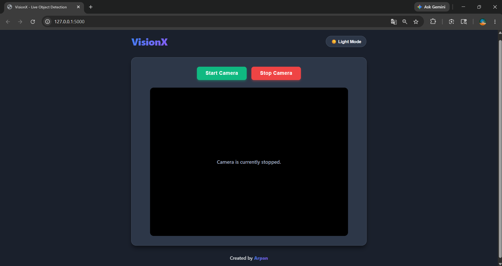
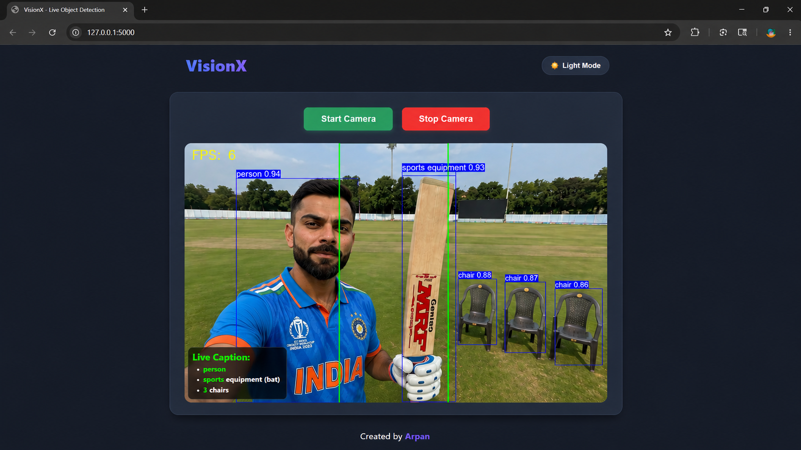

# 👁️ VisionX: Live Object Detection System


## 🚀 Overview

VisionX is a real-time object detection web application powered by YOLOv8 and Flask.  
It detects objects from webcam feed and provides live voice feedback with spatial awareness.

## ✨ Features

- Real-time YOLOv8 object detection
- Flask web application
- Voice output using pyttsx3
- Live webcam processing
- Spatial object awareness
- Modern responsive UI

## 🛠️ Tech Stack

- Python
- Flask
- OpenCV
- YOLOv8
- pyttsx3
- HTML/CSS/JavaScript

## ▶️ Run Locally

```bash
pip install Flask opencv-python ultralytics pyttsx3
python app.py

## 📸 Sample Outputs

### Live Detection Demo



---

### Region-based Object Detection


---

### Live Caption + Spatial Awareness

